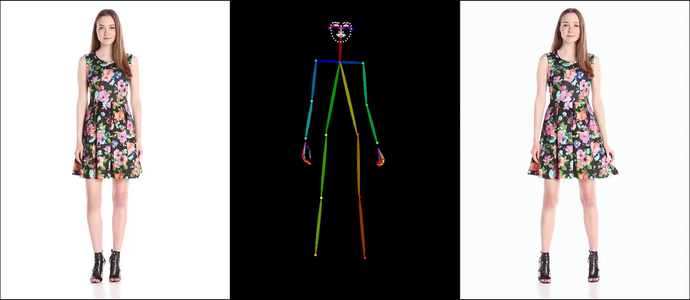
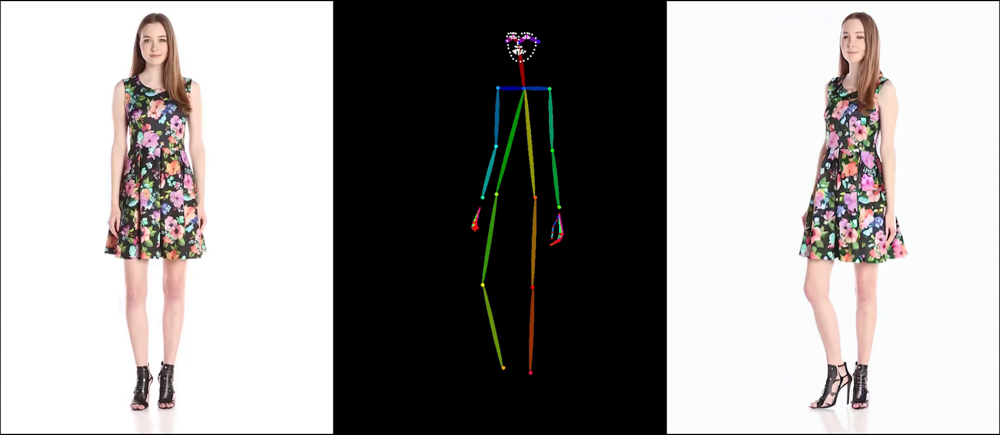
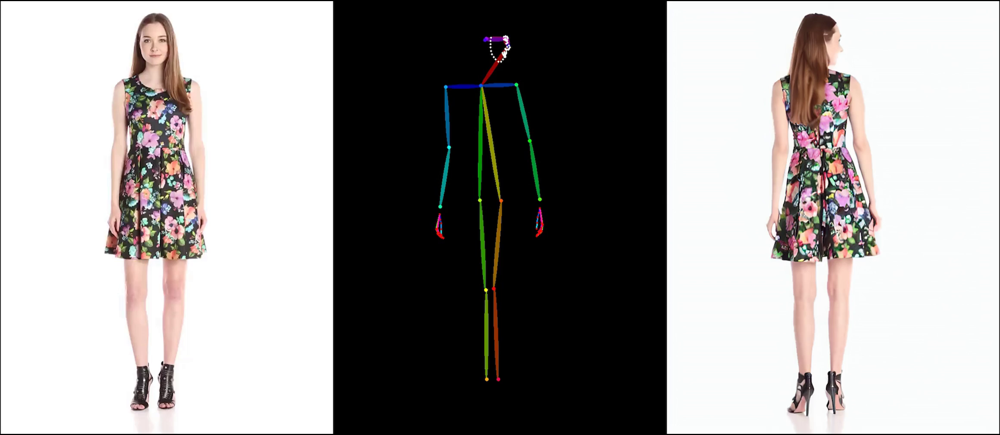
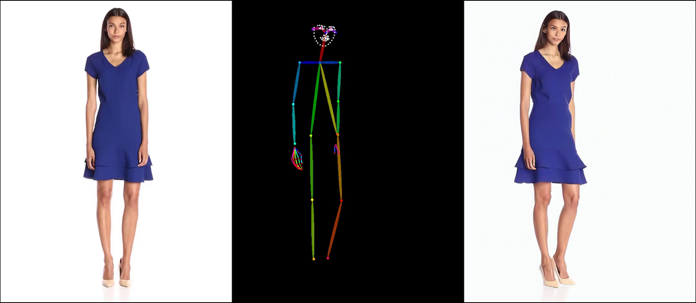
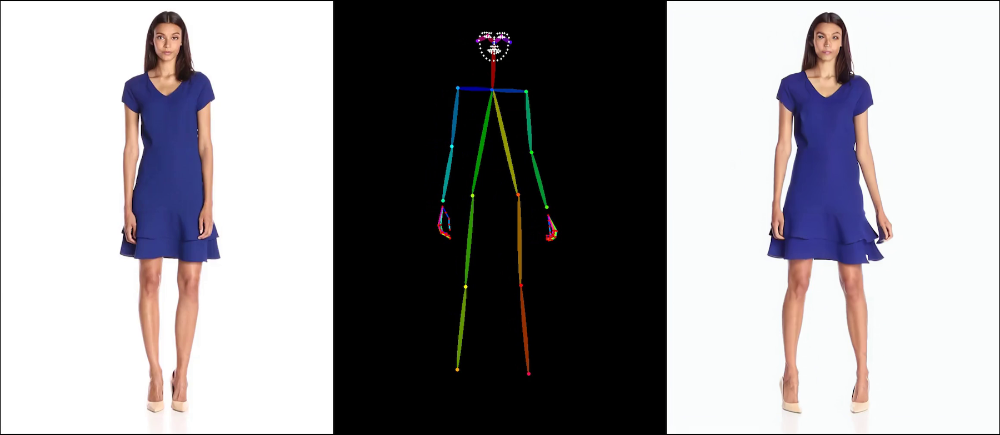
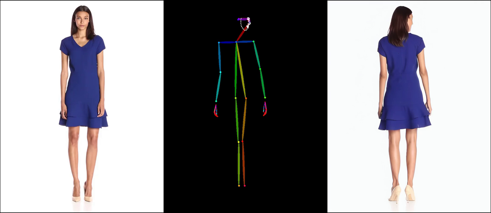
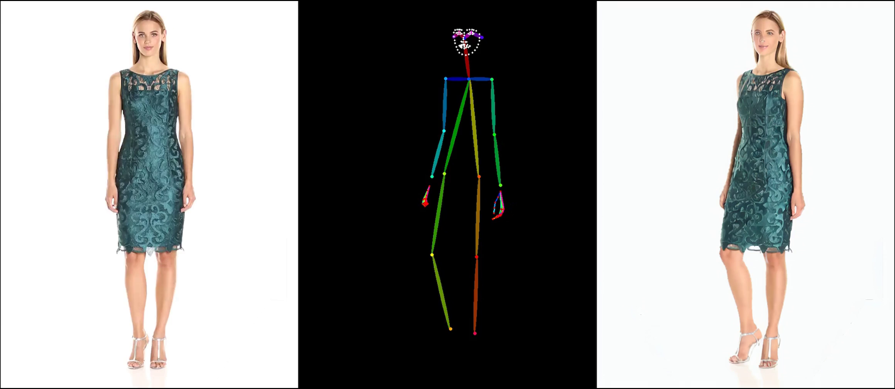
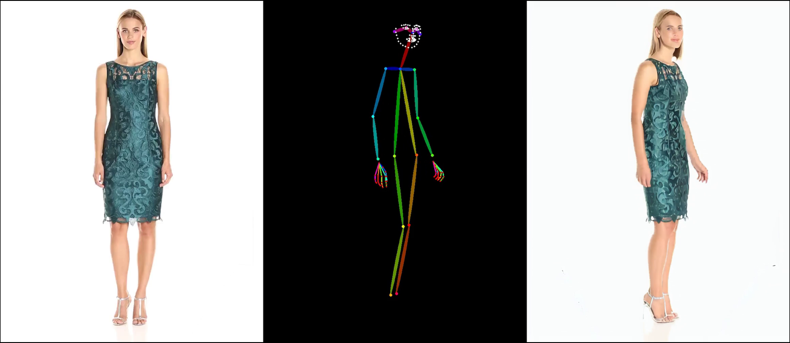
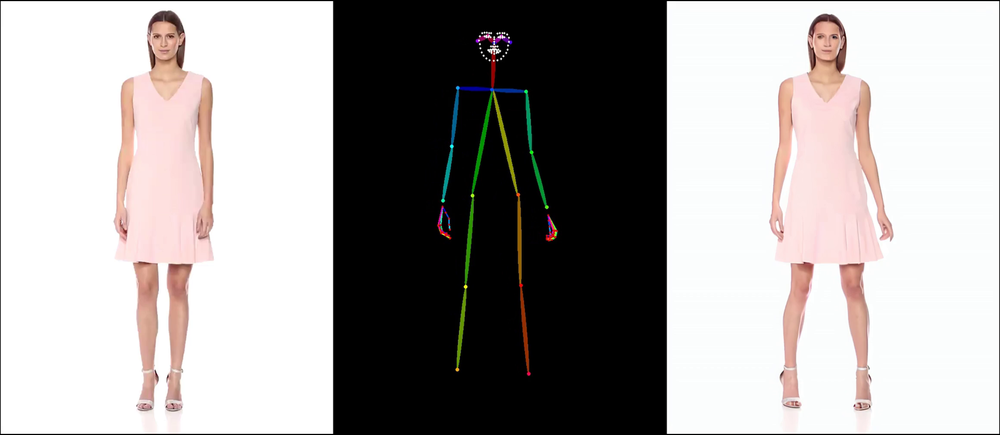
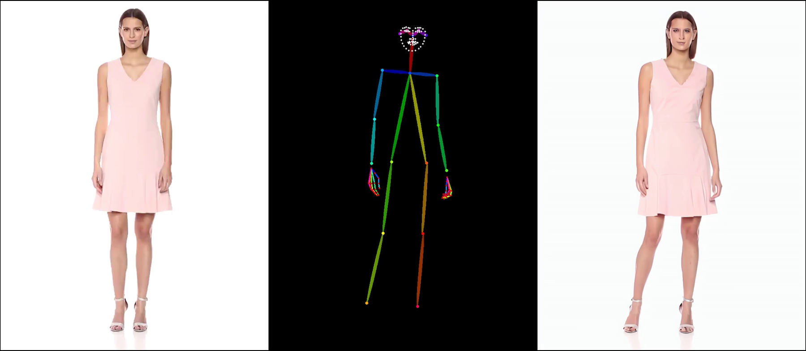

# Unofficial Implementation of Animate Anyone

If you find this repository helpful, please consider giving us a star⭐!

We only train on small-scale datasets (such as TikTok, UBC), and it is difficult to achieve official results under the condition of insufficient data scale and quality. Because of the consideration of time and cost, we do not intend to collect and filter a large number of high-quality data. If someone has a robust model trained on a large amount of high-quality data and is willing to share it, make a pull request.

## Overview
This repository contains an simple and unofficial implementation of [Animate Anyone](https://humanaigc.github.io/animate-anyone/). This project is built upon [magic-animate](https://github.com/magic-research/magic-animate/tree/main) and [AnimateDiff](https://github.com/guoyww/AnimateDiff). This implementation is first developed by [Qin Guo](https://github.com/guoqincode) and then assisted by [Zhenzhi Wang](https://zhenzhiwang.github.io/).

## Training Guidance
Although we cannot use large-scale data to train the model, we can provide several training suggestions:
1. In our experiments, the poseguider in the original paper of AnimateAnyone is very difficult to control pose, no matter what activation function we use (such as ReLU, SiLU), but the output channel is enlarged to 320 and added after conv_in (such as model.hack_poseguider ) is very effective, and at the same time, compared to controlnet, this solution is more lightweight (<1M para vs 400M para). But we still think that Controlnet is a good choice. Poseguider relies on unet that is fine-tuned at the same time and cannot be used immediately. Plug and play.
2. In small-scale data sets (less than 2000 videos), stage1 can work very well (including generalization), but stage2 is data hungry. When the amount of data is low, artifacts and flickers can easily occur. Because we retrained unet in the first stage, the checkpoint of the original animatediff lost its effect, so a large number of high-quality data sets are needed to retrain the motion module of animatediff at this stage.
3. Freezing unet is not a good choice as it will lose the texture information of the reference image.
4. This is a data hungry task. We believe that scale up data quality and scale are often more valuable than modifying the tiny structure of the model. Data quantity and quality are very important!
5. High-resolution training is very important, which affects the learning and reconstruction of details. The training resolution should not be greater than the inference resolution.


## Sample of Result on UBC-fashion dataset
### Stage 1
The current version of the face still has some artifacts.  This model is trained on the UBC dataset rather than a large-scale dataset.
<table class="center">
    <tr><td></td><td></td></tr>
    <tr><td></td><td></td></tr>
    <tr><td></td><td></td></tr>
    <tr><td></td><td></td></tr>
    <tr><td></td><td></td></tr>

</table>
<p style="margin-left: 2em; margin-top: -1em"></p>

### Stage 2
The training of stage2 is challenging due to artifacts in the background. We select one of our best results here, and are still working on it. An important point is to ensure that training and inference resolution is consistent.
<table class="center">
    <tr><td></td></tr>

</table>
<p style="margin-left: 2em; margin-top: -1em"></p>

## ToDo
- [x] **Release Training Code.**
- [x] **Release Inference Code.** 
- [ ] **Release Unofficial Pre-trained Weights.**
- [x] **Release Gradio Demo.**

## Requirements

```bash
bash fast_env.sh
```

## 🎬Gradio Demo
```python
python3 -m demo.gradio_animate
```
For a 13-second pose video, processing at 256 resolution requires 11G VRAM, and at 512 resolution, it requires 23.5G VRAM.

## Training
### Original AnimateAnyone Architecture (It is difficult to control pose when training on a small dataset.)
#### First Stage

```python
torchrun --nnodes=8 --nproc_per_node=8 train.py --config configs/training/train_stage_1.yaml
```

#### Second Stage

```python
torchrun --nnodes=8 --nproc_per_node=8 train.py --config configs/training/train_stage_2.yaml
```

### Our Method (A more dense pose control scheme, the number of parameters is still small.) (Highly recommended)
```python
torchrun --nnodes=8 --nproc_per_node=8 train_hack.py --config configs/training/train_stage_1.yaml
```

#### Second Stage

```python
torchrun --nnodes=8 --nproc_per_node=8 train_hack.py --config configs/training/train_stage_2.yaml
```


## Acknowledgements
Special thanks to the original authors of the [Animate Anyone](https://humanaigc.github.io/animate-anyone/) project and the contributors to the [magic-animate](https://github.com/magic-research/magic-animate/tree/main) and [AnimateDiff](https://github.com/guoyww/AnimateDiff) repository for their open research and foundational work that inspired this unofficial implementation.

## Email

For academic or business cooperation only: guoqin@stu.pku.edu.cn
